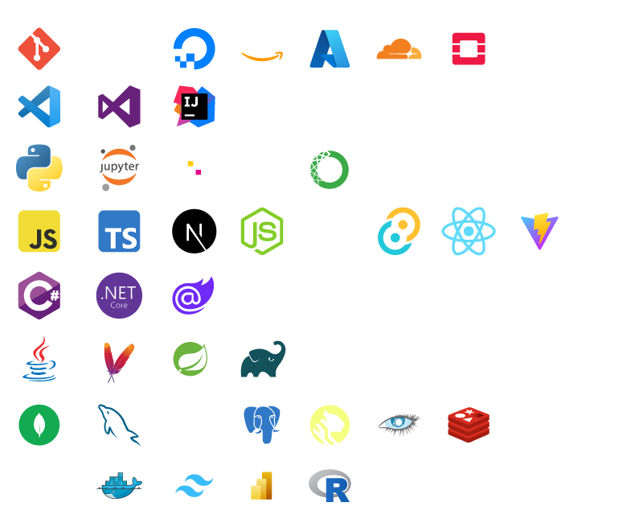

<head>
  <link rel="icon" href="assets/logo_sqr.png" />
</head>

    

👨🏿‍💻 
<h3>MrDay2Day</h3> 
Software Engineer | Systems Architect 
🌠Kingston, Jamaica 
🛠️ Passionate about building scalable systems

 
 

    

 

 

    

        
        
        
    

 

<h3>My Tech Stack</h3>

Things I know a little somthing about...

        

